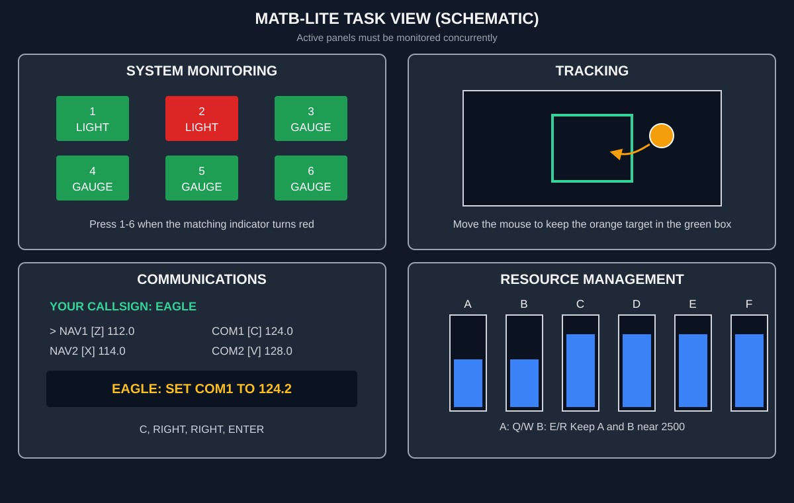

# FrontEEG Device Experiment

这是 FrontEEG 项目的独立实机采集客户端，使用 PsychoPy 实现 MATB-lite 多任务心理
负荷范式，并同步保存 LSL 双通道 EEG、任务事件、行为指标和信号质量摘要。客户端不
包含公开数据集、训练代码、模型权重或推理程序。

## 实验组成

- `Easy`：持续跟踪 + 系统监控；
- `Medium`：Easy 的两个任务 + 资源管理；
- `Difficult`：Medium 的三个任务 + 通信任务，并提高持续跟踪扰动；
- 正式任务前依次完成三个30秒练习块，练习EEG不进入校准或测试；
- 每个条件运行64秒calibration，再运行一个连续300秒test块；
- 每个任务块结束后填写 0--9 分主观心理努力评分；
- 最后执行睁眼静息、按提示眨眼和左右转头的独立伪迹测试；
- EEG 与任务事件统一使用 LSL 时钟域保存；
- 分析通道默认选择序号 `[0, 1]` 作为 Fp1、Fp2；原始文件同时保留设备输出的完整 LSL EEG 流。

正式 test 的三种负荷各为一个连续5分钟运行，与 COG-BCI MATB 的独立运行时长一致；额外的
64秒 calibration 用于后续个体适配，不会与 test 混用。连同指导、休息、评分与伪迹
测试，一次正式采集通常需要 25--30 分钟。实机程序只采集和保存数据，不在实验过程中
训练模型。

该实现保留原始 MATB 的四类并行任务及 Easy / Medium / Difficult 任务组合，但根据
普通笔记本条件作了三处轻量化：鼠标代替操纵杆、屏幕文字代替音频无线电、使用简化的
六水箱八泵动力学。它不是 NASA MATB-II 软件的逐像素复刻。

## 先理解界面和任务

计时任务界面固定分为四个面板，示意图如下。未启用的面板会显示
`INACTIVE IN THIS RUN`，该轮可以完全忽略它。



同一任务块内启用的面板需要**同时关注**。实验不要求把所有任务做到满分；
多任务竞争造成的忙乱和漏报本身就是高心理负荷条件的一部分。

### TRACKING：右上，始终启用

- 橙色圆点会持续漂移；
- 移动鼠标，尽量将圆点维持在绿色中央框内，不需要点击；
- 圆点向右偏就向左移鼠标，向上偏就向下移；
- Difficult 中漂移更强、中央框更小。

### SYSTEM MONITORING：左上，始终启用

- 六个指示器标为 `1–6`；
- 绿色表示正常，不要按键；
- 某个指示器变红时，立即按与它编号相同的数字键；
- 按错编号或在没有红色告警时按键会记为误报。

### RESOURCE MANAGEMENT：右下，Medium 和 Difficult 启用

目标只是将 A、B 两个主水箱保持在 2500 附近。蓝色通常表示在允许范围，
变红表示偏差较大。底部始终显示泵的按键、方向与 `ON/OFF/FAIL` 状态，
无需脱离界面背诵。

| 按键 | 泵送方向 | 简化理解 |
|---|---|---|
| Q | C → A | A 的默认基础补水 |
| W | D → A | A 过低时加速补水 |
| E | E → B | B 的默认基础补水 |
| R | F → B | B 过低时加速补水 |
| T | C → D | 备用水箱之间转移 |
| Y | E → F | 备用水箱之间转移 |
| U | A → B | A 向 B 转移 |
| I | B → A | B 向 A 转移 |

对初次使用者，记住“**A 看 Q/W，B 看 E/R**”就足够。Q 和 E 在每轮开始时
默认开启；平时每隔数秒扫一眼 A、B，A 偏低时暂时打开 W，B 偏低时暂时
打开 R，接近 2500 后再关闭。Difficult 中泵可能显示 `FAIL`，此时暂时不能操作，
稍后会自动恢复。

### COMMUNICATIONS：左下，仅 Difficult 启用

参与者呼号固定为 `EAGLE`。消息形如 `EAGLE: SET COM1 TO 124.2`。
只响应 EAGLE；看到 `FALCON`、`RAVEN` 或 `VIPER` 时什么都不按。

| 通道 | 选择键 |
|---|---|
| NAV1 | Z |
| NAV2 | X |
| COM1 | C |
| COM2 | V |

例如收到 `EAGLE: SET COM1 TO 124.2`，而 COM1 当前为 124.0：

1. 按 `C` 选择 COM1；
2. 按两次右方向键，每次改变 0.1；
3. 按 Enter 确认。

### 三种负荷条件

| 条件 | 同时启用的任务 |
|---|---|
| Easy | Tracking + System Monitoring |
| Medium | Easy 的两项 + Resource Management |
| Difficult | Medium 的三项 + Communications，并增强 Tracking 扰动和泵故障 |

建议的注意力优先级是：

1. 先处理有时限的红色告警和 EAGLE 通信；
2. 不断将橙色圆点拉回中央；
3. 利用空隙检查变化较慢的 A、B 水位。

## 哪些页面会自动结束

- 文字说明页不会自动消失：阅读后按空格；
- 倒计时和四面板计时任务会自动结束；
- 主观心理努力评分页：按下 `0–9` 中任意一个数字就立即提交，不需要再按空格；
- 休息页会自动倒计结束；
- 最终 `Experiment complete` 页需要再按一次空格，才会保存并退出；
- 任何时候按 Esc 都会安全中止并尽可能保存已采集的数据。

## 短测试的完整流程

`device_experiment_smoke.yaml` 是工程验收，不是有效科研实验。它将事件间隔
刻意压缩，因此会比正式实验更仓促。只需确认画面、按键、EEG 和保存链路正常，
不需要追求行为得分。通常用时 2–4 分钟。

| 顺序 | 阶段 | 操作 |
|---:|---|---|
| 1 | EEG 预检 | 确认流名、通道、单位、观测采样率和时间戳修复数，然后按空格 |
| 2 | 总说明 | 按空格 |
| 3 | Practice | Easy、Medium、Difficult 各 4 秒；每块前的说明页按空格 |
| 4 | Calibration | Medium、Difficult、Easy 各 8 秒；每块后按一个 0–9 评分 |
| 5 | Test | Difficult、Easy、Medium 各 8 秒；每块后按一个 0–9 评分 |
| 6 | Artifact | 睁眼静息、按提示眨眼、按提示左右转头，各 4 秒 |
| 7 | 完成 | 在最终页按空格，等待窗口关闭和终端输出 `status=completed` |

## 正式实验的完整流程

| 顺序 | 阶段 | 条件与时长 | 数据用途 |
|---:|---|---|---|
| 1 | EEG 预热与预检 | 约 5 秒，确认后按空格 | 确认采集链路，不进入负荷评分 |
| 2 | Practice | Easy、Medium、Difficult 各 30 秒 | 仅用于熟悉任务，不进入 calibration/test |
| 3 | Calibration | Medium、Difficult、Easy 各 64 秒 | 仅用于少标签个体适配 |
| 4 | Test | Difficult、Easy、Medium 各 300 秒 | 独立最终评估，不得用于训练或选择 |
| 5 | Artifact | 睁眼、按提示眨眼、按提示转头各 20 秒 | 只评估伪迹，不标记为心理负荷 |
| 6 | 完成与验收 | 最终页按空格，再运行会话验收脚本 | 确认原始 EEG、事件、块边界和采样连续性 |

正式流程包含练习、指导、休息、评分和伪迹阶段，通常需要 25–30 分钟。
正式 calibration/test 任务块之间休息 30 秒，三个 test 块各为一个连续 5 分钟运行。

### 伪迹阶段怎么做

1. `Eyes open`：保持头部和身体静止，睁眼注视中央十字；
2. `Paced blink`：平时注视十字，只在出现 `BLINK` 时眨一次眼；
3. `Head motion`：根据 `TURN LEFT/RIGHT` 缓慢转头，然后回到正中。

### 安全中止与数据保留

如果出现头痛、头晕、皮肤不适、明显疲劳或其他不适，应立即按 Esc 中止，
不应为了完成数据而继续佩戴。安全中止时程序会尽可能生成 `raw_eeg.npz`、
`events.tsv` 和 `session_metadata.json`；即使进程异常退出，增量写入的
`raw_eeg_recovery.csv` 也应保留已接收的原始 EEG。中止会话不能冒充完整正式实验，
但已完成的任务块仍可用于设备和信号质量诊断。

## 只下载实机客户端

在 Windows 电脑的 Anaconda Prompt 或 PowerShell 中执行：

```powershell
git clone --branch device-experiment --single-branch --depth 1 https://github.com/wcycn/FrontEEG-Transfer.git
cd FrontEEG-Transfer
```

该命令只检出本分支当前的轻量实机客户端，不下载训练分支的文件和历史提交。

## 安装环境

推荐在 Windows 上安装 Miniconda 或 Anaconda，并创建独立的 Python 3.11 环境：

```powershell
conda create -n fronteeg-device python=3.11 -y
conda activate fronteeg-device
python -m pip install -r requirements-device.txt
python -m pip install -e . --no-deps
```

实验界面全部使用英文和 ASCII 字符，默认字体为 Arial，避免中文字体缺失造成方框、
乱码或排版异常。该环境只包含实机显示和采集依赖，不需要安装 PyTorch、CUDA 或训练
环境。

## 默认连接方式：单台 Windows 电脑

默认情况下，厂商软件、LSL 数据源、PsychoPy 范式和数据保存都运行在同一台 Windows
电脑上：

```text
EEG 设备 -> Windows 厂商软件 -> 本机 LSL
                                -> PsychoPy 实验
                                -> 本地会话文件
```

这种方式不需要局域网通信，不需要端口转发，也不需要修改 Windows 防火墙。实验时先
启动厂商软件并开启 LSL 输出，再在同一台电脑上运行本仓库的检查和实验命令。

在厂商界面中看到实时波形并不等于 LSL 已开启；必须继续完成下一节的数据流检查。

## 检查数据流

在同一台 Windows 电脑上执行：

```powershell
conda activate fronteeg-device
python scripts/inspect_lsl_streams.py --stream-name "实际EEG流名称" --channel-indices 0 1 --watch-seconds 10
```

程序会列出流名称、类型、通道数、声明采样率、第一条样本和十秒观测采样率。必须确认：

1. 选中的流为 `type=EEG`；
2. `observed_rate_hz` 接近设备声明采样率，`finite=True`，两个通道的标准差和峰峰值均不为0；
3. 输出的`selected_labels`确实为Fp1、Fp2；若厂商LSL没有标签，必须根据厂商界面人工确认索引；
4. `configs/device_experiment.yaml` 的 `channel_indices` 对应 Fp1、Fp2；
5. `input_unit` 与厂商输出一致，只能填写 `microvolts` 或 `volts`。

若出现多个 EEG 流，后续通过 `--stream-name` 指定实际流名称。

## 三步上机检查

### 1. 不连接设备的界面检查

```powershell
python scripts/run_psychopy_device_experiment.py --config configs/device_experiment_smoke.yaml --participant smoke01 --simulate-eeg --windowed
```

这一步用 8 秒任务块验证 PsychoPy、鼠标、按键、随机事件、伪迹提示和文件保存，不产生
有效实验数据。

### 2. 连接真实 LSL 的短实验

```powershell
python scripts/run_psychopy_device_experiment.py --config configs/device_experiment_smoke.yaml --participant pilot01 --stream-name "实际EEG流名称" --windowed
```

确认程序能持续接收EEG、鼠标tracking不会在屏幕边缘失灵、全部按键可用、三段伪迹提示可见，
并成功保存完整文件。
短实验结束后立即运行会话验收脚本；只有显示`"result": "PASS"`才进入正式实验。

### 3. 正式实验

```powershell
python scripts/run_psychopy_device_experiment.py --config configs/device_experiment.yaml --participant self01 --stream-name "实际EEG流名称"
```

正式任务完成后**先不要关闭厂商软件或摘下电极**，立即执行：

```powershell
python scripts/validate_recorded_session.py --session data/private_device_sessions/self01_实际时间戳
```

只有输出`"result": "PASS"`后，才结束设备采集。若验收失败，应在设备仍连接时查看报错，
保留整个会话目录并决定是否需要重采。

参与者编号只能使用匿名英文字母、数字、下划线或连字符，不要填写姓名和学号。实验中：

- 说明页按空格，评分页只按一个数字；
- 只关注当前显示为活动的面板，详细操作见前文“先理解界面和任务”；
- 按 Esc 可安全中止并保存已经采集的数据；
- 正式负荷任务保持身体稳定、自然眨眼；
- 刻意眨眼和转头只在最后的伪迹阶段执行。

程序不会在任务界面直接显示 Easy、Medium 或 Difficult 标签；被试只能看到本轮激活
的任务面板，避免因标签暗示主观负荷。正式采集前应先运行 smoke 配置，让被试理解所有
按键，再重新启动正式实验。

## 输出文件

每次实验创建一个独立目录：

```text
data/private_device_sessions/参与者编号_时间戳/
├── session_plan.json
├── raw_eeg_recovery.csv
├── raw_eeg.npz
├── lsl_stream_info.xml          # 厂商提供描述时存在
├── events.tsv
└── session_metadata.json
```

- `session_plan.json`：任务开始前即保存的完整配置、随机顺序和LSL元数据；
- `raw_eeg_recovery.csv`：采集过程中逐块刷新到磁盘的完整EEG流；即使程序或电脑意外退出，也可用于恢复。
  厂商原始 LSL 时间戳与修复后的单调分析时间戳均被保留，
  `timestamp_repaired` 标记发生过重建的数据块；
- `raw_eeg.npz`：正常或安全中止时原子生成，含Fp1/Fp2、完整原始EEG流、两套时间戳、采样率、通道标签与单位；
- `events.tsv`：每个事件发生时立即增量写入，最终再原子整理；包含任务块边界、监控警报、通信消息、泵操作、反应结果和伪迹提示；
- `session_metadata.json`：最终状态、配置、随机顺序、各子任务行为指标、主观评分、LSL 元数据和
  信号质量摘要。

`data/` 已从 Git 排除。原始 EEG 不应提交到 GitHub；实验完成后通过加密移动存储或
受控文件传输复制到分析服务器。

## 可选连接方式：Windows 与 Linux 双机

只有在必须让 Linux 电脑显示 PsychoPy 界面时，才使用双机方案：

```text
EEG 设备 -> Windows：厂商软件 + LSL Outlet
                            |
                       私有局域网
                            |
             Linux：PsychoPy + LSL Inlet + 数据保存
```

两台电脑必须处于同一个可信私有局域网。Linux 端也使用本 README 前面的克隆和环境安装
命令。实验界面在 Windows 和 Linux 上都默认使用 Arial。

LSL 不是单个固定 TCP 端口。它通常使用 UDP 16571 发现数据流，并使用 TCP/UDP
16572--16604 传输数据和同步时钟，因此 Windows 的单端口 TCP `portproxy` 不能完整
转发 LSL。

将 Windows 当前网络设为“专用网络”，然后以管理员身份运行 PowerShell：

```powershell
powershell -ExecutionPolicy Bypass -File scripts\windows_enable_lsl_firewall.ps1
```

只读查看相关端口：

```powershell
powershell -ExecutionPolicy Bypass -File scripts\windows_monitor_lsl_ports.ps1
```

这些规则只应对可信专用网络启用，不能把 LSL 端口暴露到公网。校园 Wi-Fi 可能隔离
不同终端，优先使用私人路由器、手机热点或网线。远程训练服务器不应放入实时采集
链路；实验结束后再传输会话文件。

## 常见问题

### Windows 本机找不到 LSL 流

确认厂商软件已经开启专门的 LSL 输出，而不仅是显示设备波形。关闭并重新启动厂商
软件的 LSL 功能，然后重新运行检查命令。本机模式不需要开放防火墙端口。

### 双机模式下 Linux 找不到 Windows 的 LSL 流

依次确认两台电脑处于同一子网、Windows 网络为“专用”、防火墙规则已启用，并暂时
断开 VPN 和虚拟网卡。校园 Wi-Fi 可能隔离不同终端，此时优先使用私人路由器、手机
热点或网线连接。

如果仍然无法发现，不要改用单端口 TCP 转发，应退回默认的 Windows 单机模式。

### 文字或符号显示异常

实验界面只包含英文和 ASCII 字符，默认使用 Arial。若系统没有 Arial，可以在配置文件
的 `display.font` 中填写其他已安装的英文字体。

### 找到流但没有样本

重新确认厂商软件已经开始实时采集，而不仅是创建了流名称。检查工具会在超时后明确
报告“发现流但没有收到样本”，正式实验也会在显示任务前执行预热检查。

## 目录结构

```text
configs/                 正式和短测试配置
scripts/                 LSL 检查、PsychoPy 实验和 Windows 网络脚本
src/fronteeg_transfer/   采集、MATB 状态引擎、显示和事件保存模块
tests/                   实机客户端的无硬件单元测试
requirements-device.txt  轻量采集环境依赖
```

正式采集的原始数据同时保留增量CSV和最终NPZ两份。不要手工删除`raw_eeg_recovery.csv`；
它是在NPZ写入失败或程序崩溃时的最后恢复来源。

开发检查：

```powershell
ruff check src scripts tests
pytest -q
```

## License

本实机客户端采用 [MIT License](LICENSE)。它不包含或重新分发 COG-BCI 原始数据。

## 范式依据

- [COG-BCI 数据集论文（Scientific Data, 2023）](https://www.nature.com/articles/s41597-022-01898-y)
- [数据采集使用的修改版 MATB 源码](https://github.com/VrdrKv/MATB)
