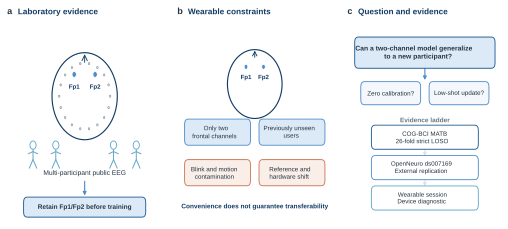
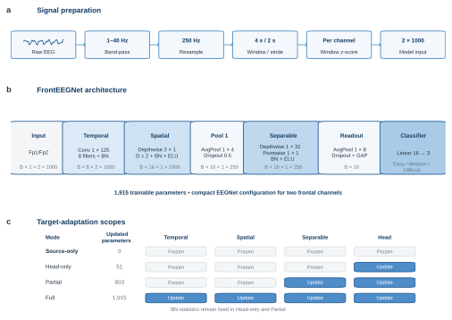

<h1 align="center">FrontEEGNet: Evaluating an EEGNet Adaptation for Cross-Subject Mental Workload Decoding with Two-Channel Wearable EEG</h1>

<strong>Chenyu Wang（王晨宇）</strong> 浙江大学

## Abstract

可穿戴脑电（electroencephalography, EEG）有望降低被动式脑机接口的部署门槛，但实际设备通常仅提供少量通道，其采集条件也与实验室系统存在显著差异。本文研究当输入被限制为目标可穿戴设备所提供的额区 Fp1 和 Fp2 通道时，能否对未见受试者的任务定义心理负荷进行解码。本文并未提出新的神经网络家族，而是将已有 EEGNet 架构适配到双通道原始波形输入，并将这一具体实现称为 FrontEEGNet，在面向部署的实验约束下开展系统评估。在 COG-BCI 多属性任务集（Multi-Attribute Task Battery, MATB）上，26 折受试者和会话互斥的留一受试者实验将源域训练、源域跨会话验证和目标受试者测试完全分离。FrontEEGNet 仅含 1,915 个可训练参数，在三分类任务上取得 54.72% ± 5.46% 的平衡准确率，较同折功率谱密度（power spectral density, PSD）多层感知机高 5.57 个百分点（配对 bootstrap 95% 置信区间：1.91–9.34）。基于目标 S1 的微调始终优于使用相同目标数据从零训练，但仅分类头、部分参数和全参数三种微调均未使总体均值超过零校准推理；最佳适配结果为每类 16 个标签时的 53.31%。单通道消融使 Fp1 和 Fp2 条件下的性能分别下降 3.87 和 3.21 个百分点，而缩短时间卷积核以及采用固定共模/差模空间投影时，相对选定配置的配对置信区间均包含 0。在四分类 OpenNeuro ds007169 n-back 数据集上，相同架构重新训练后达到 30.16% ± 5.60%，高于 25% 的随机水平，但未显著优于 PSD。合成额区瞬态干扰表明模型对类似眨眼和运动的污染较为敏感。最后，本文将基于全部公开数据训练并冻结的模型用于一次中途终止的可穿戴设备自测数据；采集与推理链路可以端到端运行，但由于测试类别不完整，不能据此计算有效的三分类实机指标。在本研究的固定公开数据协议下，紧凑双通道模型对未见受试者保留了一定预测能力；这一结果尚不能证明真实可穿戴环境中的有效性，少样本更新、伪迹敏感性和跨硬件偏移仍未解决。

## 1 Introduction

被动式脑机接口无需用户主动发出控制指令，而是从神经生理信号中估计其状态 [1]。心理负荷是其中一个重要目标，因为对任务需求的估计可用于自适应交互、训练系统和安全监测。EEG 具有非侵入和高时间分辨率的优势，但大多数受控研究依赖高密度电极帽、导电介质准备、固定的实验室放大器以及专业操作人员，这些条件限制了 EEG 在重复测量和日常场景中的应用。

可穿戴 EEG 试图降低上述负担。紧凑硬件能够缩短准备时间，并支持限制更少的采集 [2]，但便携性同时改变了统计问题本身。少通道配置损失了空间信息；额区电极容易受到眼动和面部活动影响；设备特有的参考方式、滤波、增益、电极接触和时间同步也会改变输入分布。因此，从实验室数据中选取两个名称相同的通道，并不能保证原有算法在可穿戴设备上仍然可靠。

本研究由一款仅提供 Fp1 和 Fp2 EEG 的商用设备所驱动。由于厂商未披露完整硬件规格，本文不分析其专有电子设计，也不对无法直接观测的硬件性质作出推断。我们以该设备的可用导联为约束，提出一个更一般的问题：当已有实验室 EEG 算法被限制为两个额区通道时，还保留多少跨受试者心理负荷信息；当所得流程进一步用于实体设备时，又会出现哪些失效模式？

本文研究任务定义的心理负荷。主要公开基准 COG-BCI 包含 Easy、Medium 和 Difficult 三种 MATB 条件的多次重复采集 [3]。这些标签描述实验任务需求，而非临床状态、个体固有认知能力或注意力的直接测量。已有研究常将 theta、alpha 和 beta 功率与心理负荷联系起来，但这些效应的方向和可靠性会随任务及个体变化 [4]。因此，即使尚未引入通道和硬件差异，跨受试者解码本身也具有较高难度。

随机划分窗口无法回答上述方法学问题。EEG 分布会随解剖差异、任务策略、基线状态、记录会话和电极接触发生变化；尤其在窗口相互重叠时，同一受试者的相邻样本具有很强相关性。本文采用受试者和会话互斥的评估协议：测试受试者不参与源域训练和模型选择，测试记录所在会话也不参与源域训练。下文将不使用任何目标受试者数据的设置称为受试者独立泛化或 source-only 推理，将利用目标会话 1 标签更新参数的设置称为目标受试者适配；二者共同用于考察迁移相关能力，但不作概念混同。

在受控比较线性分类器、多层感知机（MLP）、图卷积网络、协方差方法和对齐方法后，我们选择 EEGNet [8] 作为主架构。EEGNet 是已有的紧凑卷积模型，本文不主张发明了该网络。我们围绕 Fp1/Fp2 心理负荷解码对其输入、时间尺度、训练协议和部署路径进行适配，并将这一具体实现称为 **FrontEEGNet**。本文随后检验：该模型能否迁移到未见受试者；双通道限制下哪些结构选择确有作用；相同架构能否在第二个心理负荷数据集上复现；模型对额区污染有多敏感；冻结的公开数据模型用于实体设备时会发生什么。

本文的主要贡献如下：

1. 实现 FrontEEGNet，即面向 4 s Fp1/Fp2 心理负荷窗口、仅含 1,915 个参数的双通道 EEGNet 配置，并明确保留 EEGNet 作为其架构来源。
2. 建立无数据泄漏的 26 折评估，在受试者身份和目标记录会话两个层面进行隔离，并将原始波形学习与同折的频谱、图、协方差和对齐基线进行比较。
3. 比较零校准推理与嵌套目标 S1 上的分类头、部分参数、全参数微调和目标数据从零训练，检验新受试者标签是否真正改善同一架构。
4. 通过单通道、时间卷积核和空间投影消融检验结构必要性，并将评估扩展至第二数据集、合成干扰和冻结模型实机诊断。

FrontEEGNet 在主要双通道协议的已评估方法中取得最高均值；外部数据未显示其相对 PSD 的确定优势，实机会话也不足以构成可穿戴有效性验证。

**Figure 1. 双通道可穿戴心理负荷解码的研究动机与评估范围。** (a) 多受试者公开 EEG 提供源域数据，但在训练前仅保留 Fp1 和 Fp2。(b) 可穿戴部署同时面临通道受限、未见用户、额区伪迹以及参考方式或硬件域偏移。(c) 证据链依次包括 MATB 严格留一受试者评估、ds007169 外部架构复现和实体设备诊断，并分别考察零校准与少样本使用。

## 2 Related Work

### 2.1 EEG Mental-Workload Decoding

心理负荷取决于任务要求与个体资源之间的相互作用。多种生理指标能够响应负荷操纵，但不存在对所有任务均有效的单一信号 [12]。关于 EEG 频谱指标的荟萃分析发现，theta、alpha 和 beta 活动均可能出现与负荷相关的变化，其中额区 theta 相对更为一致 [4]。这些结果为 EEG 解码提供了依据，但群体层面的频谱关联不等价于跨个体分类能力，也不能证明分类器已经分离出神经层面的心理负荷机制，而非任务相关的眼动、肌电或行为信息。

COG-BCI 面向被动式脑机接口研究公开，包含超过 100 h、多个认知范式和多个会话的 EEG [3]。其中 MATB 子集通过跟踪、系统监控、资源管理和通信任务构建三个难度等级。重复会话结构使其适合将真正的受试者泛化与同一记录内部的窗口识别区分开来。

### 2.2 Cross-Subject Transfer and Alignment

EEG 迁移学习已覆盖跨受试者、跨会话、跨设备和跨任务等设置 [5]。经典方法通常变换特征或协方差矩阵以减小域间差异。例如，Euclidean Alignment 利用域级协方差估计对白化试次 [6]；黎曼方法则直接在对称正定矩阵流形上处理协方差表示 [7]。这些方法具有清晰的数学基础，但双通道仅能提供极小的协方差结构，其空间建模优势可能受到限制。

深度网络可以直接从时间序列中学习表示。Schirrmeister 等人展示了端到端卷积 EEG 解码 [9]，Lawhern 等人则提出使用时间卷积、深度可分离空间卷积和可分离卷积的紧凑 EEGNet [8]。EEGNet 的参数量和计算量适合可穿戴推理，但其原始结构本身并不保证对新受试者、新会话或新放大器保持不变性。跨受试者有效性必须由严格的数据划分证明，不能仅由模型结构推断。

Demirezen 等人将图神经网络和 Sinkhorn 最优传输用于多通道 COG-BCI 的跨会话心理负荷分类 [11]。该设置使用更稠密的导联，并以传导式方式访问未标注目标会话分布。本文则将目标受试者完全排除在源训练之外，并将输入限制为 Fp1/Fp2。因此，相关工作可以为基线选择提供依据，但其数值不能与本文结果直接横向比较。

### 2.3 Low-Channel Wearable EEG

在适当条件下，移动和低成本 EEG 仍可保留有用信息 [2]。然而，从实验室高密度导联中选取两个电极，并不等价于完成实体可穿戴验证。额区通道靠近眼睛，眨眼和眼动产生的电场可能显著改变头皮 EEG [13]。当输入仅含 Fp1/Fp2 且没有独立眼电通道时，空间源分离严重欠定。心理负荷预测因此可能混合脑活动、视线行为、面部紧张、电极接触变化以及真正与负荷相关的动态。

跨硬件迁移还会引入额外分布偏移。即使两套系统均将通道标记为 Fp1/Fp2，它们仍可能在参考电极、电极材料、耦合方式、模拟滤波、量化、时间同步和物理单位上存在差异。本文据此区分三个证据层次：实验室数据限缩通道后的跨受试者性能、在另一公开数据集上重新训练相同架构的复现能力，以及模型在目标实体硬件上的诊断性运行。当前实验中，只有前两个层次具备完整的类别平衡评估。

## 3 Method

### 3.1 Problem Formulation

记 \(\mathcal{S}\) 为源受试者集合，\(t\) 为留出的目标受试者。每个 4 s Fp1/Fp2 窗口表示为

$$
x \in \mathbb{R}^{2\times1000},
$$

两个通道均以 250 Hz 采样。标签 \(y\in\{0,1,2\}\) 分别表示 Easy、Medium 和 Difficult，记录会话记为 \(r\in\{1,2,3\}\)。在每一折留一受试者实验中，模型仅使用源受试者的会话 1 和会话 2 进行监督学习：

$$
\theta_t^{*}=\arg\min_{\theta}
\sum_{s\in\mathcal{S}\setminus\{t\}}
\sum_{(x,y)\in D_{s,1}\cup D_{s,2}}
-\log p_{\theta}(y\mid x).
$$

源受试者的会话 3 仅用于早停，最终泛化性能只在 \(D_{t,3}\) 上计算。FrontEEGNet 的训练、归一化统计、超参数和检查点选择均不使用目标受试者 \(t\) 的任何样本，包括其会话 1 和会话 2。因此，这是目标受试者层面的零样本 source-only 协议。

### 3.2 Signal Preprocessing

对于 COG-BCI，首先将记录重参考至 TP10，进行 1–40 Hz 带通滤波，从 500 Hz 重采样至 250 Hz，并以 50% 重叠切分为 4 s 窗口，最后仅保留 Fp1 和 Fp2。每个窗口的每个通道独立标准化：

$$
\widetilde{x}_{c,:}=\frac{x_{c,:}-\mu(x_{c,:})}
{\sigma(x_{c,:})+\epsilon}.
$$

该操作去除单窗内的偏置和尺度，不需要任何目标受试者校准片段，但也不会消除眼动或运动伪迹。

ds007169 中已发布的双通道窗口为 200 Hz 下的 800 个采样点。我们采用多相重采样将其转换为 250 Hz，从而得到相同的 \(2\times1000\) 输入。网络主体保持不变，仅将输出层改为四分类。

### 3.3 FrontEEGNet

FrontEEGNet 是 EEGNet 面向当前应用的具体配置，而非新的模型家族。其计算流程见 Figure 2 和表 1。形状为 \(B\times2\times1000\) 的输入首先扩展为 \(B\times1\times2\times1000\)。第一层采用 8 个 \(1\times125\) 的时间卷积核学习频率选择性响应。随后，深度可分离的 \(2\times1\) 空间卷积对每个时间滤波器学习两个 Fp1/Fp2 投影，得到 16 个特征图。其后依次使用批归一化、指数线性单元、平均池化和 dropout。第二个卷积块由 \(1\times31\) 深度时间卷积及 \(1\times1\) 逐点卷积构成。全局平均池化生成 16 维表示，线性层输出三个类别的 logits。

**Figure 2. FrontEEGNet 的计算流程与目标适配范围。** (a) 统一的信号预处理生成标准化的 2×1000 输入。(b) 紧凑网络依次通过时间卷积、深度空间卷积和可分离卷积提取特征，经全局平均池化完成三分类预测。(c) 蓝色单元表示各目标适配方案中被更新的模块，灰色单元保持冻结；Head-only 与 Partial 适配中的批归一化统计量保持固定。

**Table 1. FrontEEGNet architecture for the three-class COG-BCI experiment.**

| 阶段 | 操作 | 输出通道数 | 卷积核/设置 |
|---|---|---:|---|
| 输入 | Fp1/Fp2 原始波形 | 1 | \(2\times1000\) |
| 时间滤波 | Conv2D + batch normalization | 8 | \(1\times125\) |
| 空间滤波 | Depthwise Conv2D + batch normalization + ELU | 16 | \(2\times1\)，depth multiplier 2 |
| 时间降采样 | Average pooling + dropout | 16 | pool \(1\times4\)，dropout 0.5 |
| 可分离滤波 | Depthwise Conv2D + pointwise Conv2D + batch normalization + ELU | 16 | \(1\times31\)，随后 \(1\times1\) |
| 特征读出 | Average pooling + dropout + global average pooling | 16 | pool \(1\times8\)，dropout 0.5 |
| 分类 | Linear | 3 | 16-to-3 |

模型共有 1,915 个可训练参数。在 250 Hz 下，两组时间卷积核分别覆盖约 0.50 s 和 0.124 s。我们选择紧凑架构，是因为当前可穿戴问题主要受到数据和域偏移约束，而非计算资源约束。

### 3.4 Source Training and Inference

每个外层折单独训练一个 FrontEEGNet。模型采用交叉熵损失和 Adam 优化器，学习率为 \(10^{-3}\)，batch size 为 256，随机种子为 12345。训练最多持续 40 个 epoch；若源受试者会话 3 的性能连续 8 个 epoch 未改善，则提前停止。选定检查点随后仅在目标受试者完整会话 3 上评估。

实机推理使用一个最终部署检查点：其训练集为全部 26 名公开数据受试者的会话 1 和会话 2，验证集为这些受试者的会话 3。该检查点保持相同的结构和预处理，但不计入 26 折统计。设备数据在每个任务块内依据时间戳重建为均匀 250 Hz 时间轴，进行 1–40 Hz 滤波，以 4 s 窗口和 2 s 步长切分，逐窗逐通道标准化后输入冻结网络。设备校准数据仅用于确定稳健信号幅值拒绝阈值，不更新模型参数。

### 3.5 Target-Participant Adaptation

为检验少量目标标签能否改善源模型，我们从目标受试者会话 1 中抽取每类 \(k\in\{1,2,4,8,16\}\) 个窗口，构建类别均衡且相互嵌套的子集。原始窗口重叠 50%，因此候选集先在每个类别内间隔取窗，保证被选择的校准样本互不重叠。实验使用三组独立打乱的嵌套序列；同一次重复中，\(k\)-shot 子集被所有更大预算包含。

四种训练条件使用完全相同的校准索引。**Head-only** 以 \(10^{-3}\) 学习率更新最终 16-to-3 分类器的 51 个参数。**Partial** 以 \(3\times10^{-4}\) 更新可分离时间卷积中的 depthwise、pointwise 卷积和分类器，共 803 个参数，同时固定所有 batch normalization 统计量。**Full** 以 \(10^{-4}\) 更新源模型初始化的全部 1,915 个参数。上述三种方法固定训练 200 个 epoch。**Target-only scratch** 随机初始化全部参数，以 \(10^{-3}\) 训练 500 个 epoch，作为经过更充分收敛控制的非迁移参照。实验不使用目标验证集选择 epoch；目标会话 3 在最终评分前始终保持不可见。统计时先对同一受试者的三次重复取平均，再进行群体推断。

### 3.6 Baselines

所有主要基线均采用相同的 26 个目标折。频谱基线通过 Welch 方法计算 theta（4–8 Hz）、alpha（8–13 Hz）、low beta（13–20 Hz）和 high beta（20–30 Hz）平均 PSD，从 Fp1/Fp2 得到 8 个特征。本文比较 27 参数线性分类器、639 参数 MLP 和 1,858 参数双节点 GCN。协方差基线基于 \(2\times2\) Oracle Approximating Shrinkage 协方差，分别使用黎曼最小均值距离和切空间逻辑回归。Euclidean Alignment 与 Riemannian Alignment 变体使用未标注目标会话 1 估计目标变换；本文明确报告了这一目标数据访问条件，因此它们实际上比 FrontEEGNet 使用了更多目标信息。

### 3.7 Evaluation

主要评价指标为平衡准确率：

$$
\operatorname{BAcc}=\frac{1}{C}\sum_{c=1}^{C}
\frac{\operatorname{TP}_{c}}{\operatorname{TP}_{c}+\operatorname{FN}_{c}}.
$$

Macro-F1 为各类别 F1 的非加权平均。统计单位是受试者，而不是相互重叠的窗口；这一受试者级比较遵循 BCI 基准评估的基本原则 [10]。本文报告受试者间均值和标准差；均值置信区间通过对受试者进行 10,000 次非参数 bootstrap 获得，随机种子为 12345。方法差异采用受试者配对差值进行 bootstrap。各项消融与方法比较均为探索性分析，未进行多重比较校正。

## 4 Experiments

### 4.1 Datasets and Protocol

**COG-BCI MATB.** COG-BCI 包含 29 名受试者，每名受试者在约一周间隔下完成三个会话 [3]。原始档案审计发现，sub-27 的全部 MATB 会话与 sub-17 逐文件相同；sub-25 与 sub-28 的 S1 MATB 文件完全相同，但 S2/S3 不同，因而无法唯一确定受试者身份。我们在构建任何折之前排除 sub-25、sub-27 和 sub-28，最终保留 26 人。每个会话均包含 Easy、Medium 和 Difficult MATB 条件。预处理后，每名受试者的每个会话、每个类别包含 148 个窗口，共分析 34,632 个窗口。在 26 个折中的每一折，25 名源受试者的会话 1 和会话 2 提供 22,200 个训练窗口；其会话 3 提供 11,100 个验证窗口；留出目标受试者的会话 3 提供 444 个测试窗口。

**OpenNeuro ds007169.** 该数据集包含 18 名受试者的四种 n-back 难度 [14]。本文仅保留 Fp1/Fp2，对 1-back、2-back、3-back 和 4-back 进行四分类。每名源受试者、每个类别中，时间上较早的约 75% 记录用于训练，较晚的 25% 用于验证，两者之间设置一个步长的隔离区。为使用相同测试片段，FrontEEGNet 与 PSD-MLP 均排除目标记录开头的窗口，剩余窗口全部用于测试；FrontEEGNet 不使用这些前缀窗口，而 PSD-MLP 仅用其无标签特征估计 min–max 归一化参数。该设置对 PSD-MLP 提供了更多目标域信息。这一实验是相同架构在受试者独立数据上的重新训练，并非将 COG-BCI 权重直接迁移到新任务。

**Device session.** 一名作者使用商用 Fp1/Fp2 设备完成自测，并运行英文界面的轻量 MATB。Easy、Medium 和 Difficult 三个校准块均已完成；测试阶段完成 Difficult 后，在 Easy 进行到中途时因佩戴不适而终止，未进入 Medium 测试和预设伪迹任务。本文保留不完整记录，用于检验数据采集、存储和冻结模型推理链路并分析失效模式，而不用于估计预设三分类终点。

### 4.2 Main Cross-Subject Comparison

FrontEEGNet 在所评估方法中取得最高平均性能（表 2）。其平衡准确率为 54.72% ± 5.46%，Macro-F1 为 52.70% ± 6.11%。同折 PSD-MLP 的平衡准确率为 49.15% ± 7.52%。FrontEEGNet 的配对提升为 5.57 个百分点，95% 置信区间为 1.91–9.34；在 26 名受试者中，FrontEEGNet 对 18 人更优、1 人持平、7 人较低。置信区间不跨越 0，且所有方法共享相同目标受试者折；在本次固定实现中，原始波形模型的受试者级均值高于该 PSD-MLP。

**Table 2. Strict participant-held-out performance on COG-BCI MATB. Values are mean ± between-participant standard deviation (%).**

| 方法 | 表示与目标数据访问 | 参数量 | 平衡准确率 | Macro-F1 |
|---|---|---:|---:|---:|
| Linear | 8 个 PSD 特征；目标 S1 归一化 | 27 | 46.65 ± 8.00 | — |
| PSD MLP | 8 个 PSD 特征；目标 S1 归一化 | 639 | 49.15 ± 7.52 | 49.04 ± 7.35 |
| PSD GCN | 双节点四频带图；目标 S1 归一化 | 1,858 | 49.06 ± 7.95 | 46.63 ± 10.28 |
| Tangent-space LR | \(2\times2\) 协方差；不使用目标 S1 | — | 44.53 ± 6.18 | 39.22 ± 7.54 |
| Riemannian MDM | \(2\times2\) 协方差；不使用目标 S1 | — | 43.49 ± 6.27 | 37.63 ± 9.15 |
| EA + tangent LR | 协方差；使用未标注目标 S1 | — | 43.99 ± 6.94 | 39.27 ± 8.71 |
| RA + tangent LR | 协方差；使用未标注目标 S1 | — | 45.17 ± 6.29 | 40.99 ± 7.80 |
| **FrontEEGNet** | 原始 \(2\times1000\)；不使用目标 S1/S2 | **1,915** | **54.72 ± 5.46** | **52.70 ± 6.11** |

这一比较缩小了可能的解释范围。双节点 GCN 与更小的 PSD-MLP 均值接近，协方差方法在本次实现中更弱。结果与四频带平均可能丢失部分有用窗内信息这一解释一致，但当前比较同时改变了输入表示、分类器和优化过程，不能单独证明性能差异来自时间模式。

FrontEEGNet 的 Easy、Medium 和 Difficult 类别召回率分别为 75.03%、36.46% 和 52.68%。模型最容易识别最低负荷条件，对中间类别的区分最困难。因此，其平衡准确率不能被理解为三个类别表现均匀，也不能证明模型恢复了连续心理负荷轴。

### 4.3 Low-Shot Target Adaptation

当对照是仅使用目标子集学习时，源模型初始化能够提供帮助；但微调并未改善源模型的群体均值（表 3）。每类 1 个标签时，仅分类头校准达到 51.06%，而目标数据从零训练为 41.54%。两者配对差异为 9.52 个百分点（95% CI：7.17–11.77；25 人更优、1 人更差）。在所有已测试标签预算下，源初始化方法均优于相同预算的目标数据从零训练；该实验支持匹配预算下的性能收益，但没有估计达到预设性能所需的标签数量。

更强的比较对象是零校准推理。Source-only FrontEEGNet 保持 54.72%。每类 16 个标签时，Head-only 达到 53.31%；相对 source-only 的配对差异为 −1.41 个百分点，95% 区间为 −3.27–0.32，区间包含 0。较小预算下的 Head-only 配对区间低于 0，Partial 和 Full 的低预算下降更大；每类 16 个标签时，Partial 和 Full 分别达到 52.64% 和 52.82%。因此，源初始化相对目标数据从零训练具有匹配预算优势，但没有任何已测试更新提高 source-only 的总体均值；“负迁移”只适用于配对区间明确低于 0 的具体设置，不能概括所有预算。

不同标签预算和参数更新范围之间的排序为性能下降提供了诊断性证据，但不能确定唯一原因。随着校准集增大，Head-only 逐渐接近 source-only；而在最小标签预算下，更新 803 或 1,915 个参数带来的损失更大。这一现象与高方差拟合以及群体稳定特征被部分遗忘相一致。此外，适配使用目标会话 1，而评估使用目标会话 3，因此参数更新可能吸收了无法延续到测试会话的会话特异变化。当前实验没有以析因设计分离这些机制，故本文将其视为与证据一致的解释，而不是已经确定的因果结论。

**Table 3. Nested target-S1 adaptation of the same FrontEEGNet. Values are balanced accuracy (%), averaged over three repeats within each participant and then across 26 participants.**

| 方法 | 可训练参数 | 每类 1 个标签 | 每类 4 个标签 | 每类 16 个标签 |
|---|---:|---:|---:|---:|
| Source-only | 0 | **54.72 ± 5.46** | **54.72 ± 5.46** | **54.72 ± 5.46** |
| Head-only | 51 | 51.06 ± 6.29 | 52.07 ± 5.21 | 53.31 ± 6.28 |
| Partial last block | 803 | 48.94 ± 5.98 | 50.54 ± 5.38 | 52.64 ± 6.43 |
| Full fine-tuning | 1,915 | 49.15 ± 6.15 | 51.54 ± 6.86 | 52.82 ± 7.28 |
| Target-only scratch | 1,915 | 41.54 ± 7.44 | 44.35 ± 7.94 | 47.66 ± 9.77 |

完整的 1/2/4/8/16-shot 曲线保存在机器可读结果中。面向部署时，这些结果支持将 source-only FrontEEGNet 作为默认方案；只有独立证据表明新会话确有改善时，才应启用目标更新，而不能预设个性化必然有效。

### 4.4 Architecture Ablation

我们进一步分离主要数据真正支持的结构选择（表 4）。将 125 和 31 采样点的时间卷积核替换为 63 和 15 采样点后，平均平衡准确率下降 0.56 个百分点，但配对置信区间跨越 0。将可学习双通道空间卷积替换为固定的共模与差模分量后，性能仅变化 −0.01 个百分点。两项结果均不足以支持将长卷积核或可学习空间权重描述为新的关键性能模块。

相比之下，删除任一电极都会造成可靠下降。Fp1-only 为 50.85%，Fp2-only 为 51.51%，分别下降 3.87 和 3.21 个百分点，且两个配对置信区间均位于 0 以下。这说明即使固定共模/差模基在平均表现上足以匹配可学习空间投影，同时观察两个额区通道仍然优于任一单通道。

**Table 4. FrontEEGNet ablations on the same 26 folds.**

| 变体 | 参数量 | 平衡准确率（%） | 相对完整模型差异（百分点） | 配对 95% CI |
|---|---:|---:|---:|---:|
| Full FrontEEGNet | 1,915 | 54.72 ± 5.46 | 0.00 | — |
| Short temporal kernels | 1,163 | 54.16 ± 5.77 | −0.56 | [−1.44, 0.28] |
| Fixed common/difference projection | 1,883 | 54.71 ± 5.56 | −0.01 | [−0.94, 0.91] |
| Fp1 only | 1,899 | 50.85 ± 7.02 | −3.87 | [−6.54, −1.01] |
| Fp2 only | 1,899 | 51.51 ± 7.52 | −3.21 | [−6.44, −0.06] |

### 4.5 External Participant-Disjoint Validation

在 ds007169 上，四分类 FrontEEGNet 因输出层增加至四个单元而包含 1,932 个参数。18 名留出受试者的平均平衡准确率为 30.16% ± 5.60%，Macro-F1 为 23.60% ± 5.87%。其均值高于 25% 随机水平 5.16 个百分点，该差异的受试者 bootstrap 95% 置信区间为 2.57–7.76；18 人中有 14 人高于随机水平。

匹配协议的 PSD-MLP 为 29.77% ± 5.26%。FrontEEGNet 相对其配对提高仅 0.39 个百分点，95% 置信区间为 −2.77–3.40。第二数据集上的均值和置信区间提示双通道输入含有高于随机水平的受试者独立预测信息，但没有复现 FrontEEGNet 在 MATB 上相对 PSD 的优势。1-back 至 4-back 的汇总召回率分别为 55.03%、13.92%、44.13% 和 10.18%，表明两个偶数类别存在严重混淆。数据集间的任务和采集差异仍具有决定性影响。

### 4.6 Artifact Robustness and Physical-Device Diagnostic

**Synthetic artifact stress.**

由于 Fp1/Fp2 容易受到额区伪迹影响，我们在不重新训练的情况下，对每一折 MATB 留出测试窗口加入确定性的类眨眼脉冲和类运动瞬态。无污染时平衡准确率为 54.72%。50、100 和 200 微伏眨眼脉冲使其分别下降至 49.93%、45.45% 和 40.38%，对应损失 4.79、9.27 和 14.34 个百分点。25、50 和 100 微伏运动瞬态下，性能分别为 52.88%、48.72% 和 41.60%，对应损失 1.84、6.00 和 13.12 个百分点。所有配对下降的受试者级 95% 置信区间均低于 0。

该实验建立的是受控干扰敏感性，而非真实伪迹发生率。合成波形无法判断无污染条件下的预测究竟来源于脑活动还是自然存在的眼动和肌电相关信号。不过，随干扰幅度单调下降的结果说明，双通道部署需要信号质量监测或伪迹感知训练，不能仅依赖逐窗标准化。

**Physical-device diagnostic.** 自测共记录 276,810 个双通道采样点，名义采样率为 250 Hz，总时长 18.49 min。三个校准块均完整结束。独立测试阶段包含一个完整的 300 s Difficult 块，共 149 个窗口；随后记录 216.55 s Easy，得到 107 个窗口后中止，未获得 Medium 测试块。中止的主要原因是硬质佩戴结构调节范围有限、电极难以持续贴合额部，同时局部压力随佩戴时间增加并造成疼痛。未来设备可考虑柔顺材料、可调节支撑、能够适配头部曲率的电极浮动结构、更均匀的压力分布，以及连续接触质量反馈。

诊断使用基于全部 26 名公开数据受试者训练的冻结部署模型，不利用实机标签更新参数。设备校准片段仅用于设定信号幅值质量阈值，256 个测试窗口中有 5 个被拒绝。在全部已记录窗口上，Difficult 召回率为 60.40%，Easy 召回率为 51.40%；模型共预测 102 个 Easy、28 个 Medium 和 126 个 Difficult。上述两个召回率仅用于描述已记录任务块。由于 Easy 未完成且 Medium 缺失，本文不将二者平均值报告为主要平衡准确率。

采集审计还发现，在重建按接收顺序单调递增的时间轴后，仍有 106 个采样间隔超过 8 ms，最大间隔为 106.78 ms。LSL 流未声明物理单位，因此无法通过元数据独立验证量纲。该实验表明软件能够完成实体设备数据的采集、保存、时间重建、预处理和分类，但同时暴露了受控公开数据准确率无法解决的硬件域偏移与人体工学边界。

## 5 Discussion

在主要固定协议下，将实验室记录限缩为 Fp1/Fp2 后，紧凑原始波形模型仍表现出高于所比较基线的受试者独立、跨会话预测性能。FrontEEGNet 在不读取任何目标受试者 EEG 的条件下，比最强同折 PSD 基线提高 5.57 个百分点。频谱 MLP、GCN、协方差模型和对齐方法均使用相同目标折，并明确区分各自的目标数据访问条件，因此这一比较具有实际意义。

本文贡献主要是经验性和应用转化性的，EEGNet 构成架构基础。本文所做的工作是确定双通道配置、建立严格评估协议、通过消融区分得到支持的设计选择，并将模型进一步带到外部数据集和实体采集链路。消融结果对于这一定位尤为重要：它们不支持把长时间卷积核或可学习空间滤波描述为新机制，但支持同时保留两个通道，而不是退化为单通道方案。

少样本实验区分了两个容易被混淆的结论。首先，在所有已测试预算内，源模型初始化的适配方法均优于目标数据从零训练。其次，使用目标标签并不会自动改善已经训练好的源模型：最佳适配均值仍低于 source-only，且在最小预算下，更新更多参数造成的性能损失更加明显。因此，在本次协议所覆盖的候选方案中，零校准是均值最高的部署策略，而不是未经比较的默认选择。

这一负迁移可能由多个并存机制解释。Source 模型由 25 名受试者的数据估计，并以留出的源受试者会话完成模型选择；每次目标更新则仅使用单个会话的 3–48 个带标签窗口。如此有限的适配集可能使少数非典型或受伪迹污染的窗口获得过大影响，并将表示从较稳定的群体解推离。Head-only 随标签预算增加而逐步恢复、且扩大参数更新范围在低预算下造成更大损失，与这一解释相一致。其次，校准和测试分别来自目标会话 1 和会话 3，跨会话非平稳性可能使模型拟合只存在于校准会话的状态、接触或噪声模式。Full fine-tuning 还可能受到小样本 batch normalization 统计不稳定的影响；然而 Partial 固定了 batch normalization 统计仍然下降，说明这一因素无法单独解释结果。最后，为避免测试信息泄漏，当前固定 epoch 协议没有使用目标会话验证集，因此可能错过不同受试者各自的最佳早停位置。要区分这些解释，需要设置独立的目标验证片段，并保留更晚且完全未参与适配的测试会话；当前实验确定的是性能边界，而不是唯一因果机制。

外部结果限制了主数据集上的增益范围。FrontEEGNet 在四分类 n-back 中仍显著高于随机水平，但相对 PSD 的优势不确定，且类别间错误严重不均衡。这可能来自任务、标签语义、采集系统、预处理或受试者群体的差异，也说明在一个 EEG 基准上选出的模型不能被表述为普遍可迁移。

伪迹和实机证据揭示了两个部署瓶颈。首先，额区瞬态干扰可能抵消受控数据中相当一部分性能优势。输入中没有独立 EOG 或运动标注，因此当前设计无法判定预测究竟来自神经活动，还是任务相关的眼动、肌电或机械扰动。其次，名义通道一致并不意味着跨硬件等价。未知物理单位、采样间隔异常、电极接触和参考方式均可能使输入离开训练分布，即使两套系统都提供 Fp1/Fp2。

本研究仍存在多项限制。COG-BCI 是主要评估中唯一具有重复会话的基准；FrontEEGNet 模型族和当前配置是在查看同一组 26 折方法比较后选定，并未用独立外层数据确认选择过程，因此结果属于探索性基准证据。26 折结果使用一个预定义优化种子，尚未系统量化训练随机性。4 s 重叠窗口彼此相关，尽管统计推断已以受试者而非窗口为单位。任务条件只是心理负荷的替代标签，而非潜在认知状态的逐窗真值。合成伪迹不能完全重现真实眨眼和运动的形态及发生分布。外部数据集重新训练了架构，因此评估的是架构复现，而不是学习权重的直接跨任务迁移。最后，实体设备仅包含一名作者受试者，并在所有测试类别完成前终止，不能证明实机有效性或群体泛化。

后续工作应保持严格的留出受试者设计，同时加入完整跨日可穿戴记录、同步 EOG 或眼动追踪、运动传感器、经验证的物理单位和接触质量测量。随后可使用真实事件而非仅合成波形训练和评价伪迹感知增强。跨设备适配也应保留完全未参与适配的后续会话作为测试集。当前结果提示，相比扩大 1,915 参数分类器，改善测量稳定性和域偏移处理可能更有价值。

## 6 Conclusion

本文评估而非发明了一种用于双通道可穿戴心理负荷解码的 EEGNet 配置。FrontEEGNet 在 COG-BCI MATB 的受试者和会话互斥协议下达到 54.72% 平衡准确率，其相对同折 PSD-MLP 的配对区间不跨越 0。源初始化方法在匹配标签预算下均优于目标数据从零训练，但没有任何已测试少样本更新提高零校准推理的总体均值。Fp1 与 Fp2 均提供了信息，而当前实验不支持将选定时间卷积核或可学习空间投影视为独立结构创新。ds007169 上的均值高于随机水平，却未显示相对 PSD 的确定优势；合成污染与中途终止的单人实机自测也不能建立可穿戴有效性。总体而言，本研究只支持特定受控协议下的双通道受试者独立解码，跨任务、跨硬件和真实环境稳健性仍需进一步验证。

## References

[1] Zander, T. O. and Kothe, C. (2011). Towards passive brain–computer interfaces: applying brain–computer interface technology to human–machine systems in general. *Journal of Neural Engineering*, 8, 025005. https://doi.org/10.1088/1741-2560/8/2/025005

[2] Debener, S., Minow, F., Emkes, R., Gandras, K., and de Vos, M. (2012). How about taking a low-cost, small, and wireless EEG for a walk? *Psychophysiology*, 49, 1617–1621. https://doi.org/10.1111/j.1469-8986.2012.01471.x

[3] Hinss, M. F., Jahanpour, E. S., Somon, B., Pluchon, L., Dehais, F., and Roy, R. N. (2023). Open multi-session and multi-task EEG cognitive dataset for passive brain-computer interface applications. *Scientific Data*, 10, 85. https://doi.org/10.1038/s41597-022-01898-y

[4] Chikhi, S., Matton, N., and Blanchet, S. (2022). EEG power spectral measures of cognitive workload: a meta-analysis. *Psychophysiology*, 59, e14009. https://doi.org/10.1111/psyp.14009

[5] Wu, D., Xu, Y., and Lu, B.-L. (2022). Transfer learning for EEG-based brain–computer interfaces: a review of progress made since 2016. *IEEE Transactions on Cognitive and Developmental Systems*, 14, 4–19. https://doi.org/10.1109/TCDS.2020.3007453

[6] He, H. and Wu, D. (2020). Transfer learning for brain–computer interfaces: a Euclidean space data alignment approach. *IEEE Transactions on Biomedical Engineering*, 67, 399–410. https://doi.org/10.1109/TBME.2019.2913914

[7] Barachant, A., Bonnet, S., Congedo, M., and Jutten, C. (2012). Multiclass brain–computer interface classification by Riemannian geometry. *IEEE Transactions on Biomedical Engineering*, 59, 920–928. https://doi.org/10.1109/TBME.2011.2172210

[8] Lawhern, V. J., Solon, A. J., Waytowich, N. R., Gordon, S. M., Hung, C. P., and Lance, B. J. (2018). EEGNet: a compact convolutional neural network for EEG-based brain–computer interfaces. *Journal of Neural Engineering*, 15, 056013. https://doi.org/10.1088/1741-2552/aace8c

[9] Schirrmeister, R. T., Springenberg, J. T., Fiederer, L. D. J., Glasstetter, M., Eggensperger, K., Tangermann, M., Hutter, F., Burgard, W., and Ball, T. (2017). Deep learning with convolutional neural networks for EEG decoding and visualization. *Human Brain Mapping*, 38, 5391–5420. https://doi.org/10.1002/hbm.23730

[10] Jayaram, V. and Barachant, A. (2018). MOABB: trustworthy algorithm benchmarking for BCIs. *Journal of Neural Engineering*, 15, 066011. https://doi.org/10.1088/1741-2552/aadea0

[11] Demirezen, G., Brouwer, A.-M., and Taşkaya Temizel, T. (2026). Optimal transport and graph neural networks for cross-session mental workload classification. *Applied Sciences*, 16, 5506. https://doi.org/10.3390/app16115506

[12] Charles, R. L. and Nixon, J. (2019). A systematic review of physiological measures of mental workload. *Applied Ergonomics*, 74, 221–232. https://doi.org/10.1016/j.apergo.2018.08.028

[13] Croft, R. J. and Barry, R. J. (2000). Removal of ocular artifact from the EEG: a review. *Neurophysiologie Clinique*, 30, 5–19. https://doi.org/10.1016/S0987-7053(00)00055-1

[14] Booth, L. and Barras, M. (2026). Multimodal Cognitive Workload n-back Task, 4 Difficulties (version 1.0.5). OpenNeuro dataset. https://doi.org/10.18112/openneuro.ds007169.v1.0.5
